# Playbook-Delegation für Claude Code

**Opus plant. Sonnet und Haiku arbeiten.**

Ein Skill für Claude Code. Das große Modell (Opus) zerlegt eine Aufgabe und schreibt für jeden Teil ein genaues **Playbook**. Günstige Subagenten führen das Playbook aus: **Sonnet 5.5** oder **Haiku 5.5**. Zum Schluss prüft Opus das Ergebnis selbst nach.

Die Intelligenz des großen Modells steckt also im Plan und nicht in der Fleißarbeit. Das spart viele Tokens, und die Qualität bleibt gleich.

**[Interaktive Anleitung öffnen](https://9fw2pq8sgb-art.github.io/claude-playbook-delegation/anleitung.html)**: Ablauf zum Durchklicken, Entscheidungsbaum, Installationsbefehle zum Kopieren.

---

## Installation

**Voraussetzung:** Claude Code **2.1.293 oder neuer**. Die Version zeigt `claude --version`, aktualisieren geht mit `claude update`. Ältere Versionen kennen Haiku 5.5 nicht.

Im Terminal:

```bash
claude plugin marketplace add 9fw2pq8sgb-art/claude-playbook-delegation
```

```bash
claude plugin install playbook@playbook-delegation
```

Danach Claude Code neu starten, in der Desktop-App eine neue Session öffnen. Prüfen:

```bash
claude plugin list
```

In der Liste steht `playbook@playbook-delegation` mit Status `enabled`.

## Benutzen

Im Chat von Claude Code:

- `/playbook:delegieren` und dann die Aufgabe beschreiben, **oder**
- einfach sagen: „delegier das“, „mach das mit Subagenten“, „spar Tokens“.

Claude entscheidet selbst, welche Teile an Haiku oder Sonnet gehen und welche es selbst erledigt.

---

## So funktioniert es

### 1. Der Ablauf



1. **Auftrag:** Du beschreibst die Aufgabe.
2. **Opus zerlegt:** Opus teilt sie in Stücke und entscheidet bei jedem Stück, ob Delegieren sich lohnt. Das ist der Fall, sobald das Playbook kürzer ist als die Arbeit.
3. **Playbooks:** Für jedes Stück schreibt Opus ein Playbook.
4. **Haiku / Sonnet arbeiten:** Unabhängige Stücke laufen parallel.
5. **Gate:** Jeder Agent prüft sein Ergebnis selbst, zum Beispiel mit einem Test, einem Build oder einem Check.
6. **Opus prüft nach:** Opus lässt das Gate noch einmal selbst laufen. Der Prüfer ist nie der Arbeiter.
7. **Fertig.** Fällt das Gate durch, wird zuerst das Playbook geschärft und dann neu gestartet.

### 2. Die Modellwahl: eine Frage



| Antwort | Modell | Typische Arbeit |
|---|---|---|
| Nein | **Haiku 5.5** | suchen, lesen, extrahieren, zusammenfassen, umbenennen, formatieren, Tests/Builds laufen lassen |
| Ja | **Sonnet 5.5** | Code über mehrere Dateien, Debugging, Recherche mit Abwägung, Reviews, Texte |
| Ja, Architektur oder mehrdeutig | **Opus selbst** | planen, Grundsatzentscheidungen, Endabnahme |

Im Zweifel nimmt Opus zuerst Haiku. Ein Fehlschlag am Gate kostet weniger, als vorsorglich Sonnet zu nehmen.

### 3. Das Playbook

Jeder Auftrag an einen Agenten hat dieselbe Form:

| Feld | Inhalt |
|---|---|
| **ZIEL** | ein Satz: Was liegt am Ende vor? |
| **KONTEXT** | Pfade zum Lesen und Fakten, die der Agent nicht selbst suchen soll |
| **SCHRITTE** | nummeriert, eine Handlung pro Schritt, Entscheidungen schon getroffen |
| **VERBOTE** | was er nicht anfasst: Dateien, Push, Löschen, Nachrichten |
| **GATE** | der Check, den er vor „fertig“ selbst ausführt |
| **STOPP** | „Passt etwas nicht zum Playbook: abbrechen und melden, nicht raten.“ |
| **RÜCKGABE** | kurz und fest: Status · Dateien · Gate-Ausgabe · offene Punkte |

Fragt ein Agent nach oder rät er, war das Playbook zu dünn. An einem zu kleinen Modell liegt das selten.

### 4. Eskalation



1. Fehlschlag: zuerst das Playbook schärfen. Dasselbe Modell versucht es ein zweites Mal.
2. Wieder ein Fehlschlag: eine Stufe höher, also Haiku → Sonnet → Opus selbst.
3. Gute Playbooks werden als Vorlage gespeichert und beim nächsten Mal wiederverwendet.

---

## Optional: immer aktiv

Der Skill läuft, wenn er aufgerufen wird. Soll er immer gelten, kommen diese Zeilen in die eigene `~/.claude/CLAUDE.md`:

```markdown
## Delegation
Bei jeder Aufgabe mit viel Lesen, vielen Dateien oder Wiederholung den Skill `playbook:delegieren` anwenden:
Opus schreibt das Playbook, Subagenten laufen mit `model: "haiku"` oder `model: "sonnet"`, Opus prüft nach.
```

## Grenzen

- Jeder Subagent startet mit leerem Kontext. Schon der Start kostet Tokens: Gemessen waren es rund 67.000 für eine einzige Antwort. Bei Haiku ist das günstig, für Ein-Zeilen-Aufgaben lohnt es sich trotzdem nicht. Die erledigt Opus selbst.
- Wie viel du sparst, hängt von der Aufgabe ab. Einen pauschalen Wert gibt es nicht.
- Die Namen `haiku` und `sonnet` zeigen über die Anthropic API immer auf die neueste Version. Bei Bedrock, Vertex oder Foundry kann `haiku` noch auf Haiku 4.5 zeigen.

## Ohne Plugin-System installieren

Den Ordner `plugins/playbook/skills/delegieren/` nach `~/.claude/skills/delegieren/` kopieren. Der Aufruf heißt dann `/delegieren`. Updates kommen auf diesem Weg nicht automatisch.

## Aktualisieren und Entfernen

```bash
claude plugin marketplace update playbook-delegation
```

```bash
claude plugin marketplace remove playbook-delegation
```

Der zweite Befehl entfernt das Plugin mit.

## Aufbau

```
.claude-plugin/marketplace.json               # Katalog für "marketplace add"
plugins/playbook/.claude-plugin/plugin.json
plugins/playbook/skills/delegieren/SKILL.md   # der Skill
docs/anleitung.html                           # interaktive Anleitung (GitHub Pages)
docs/img/*.svg                                # animierte Grafiken dieser README
```
